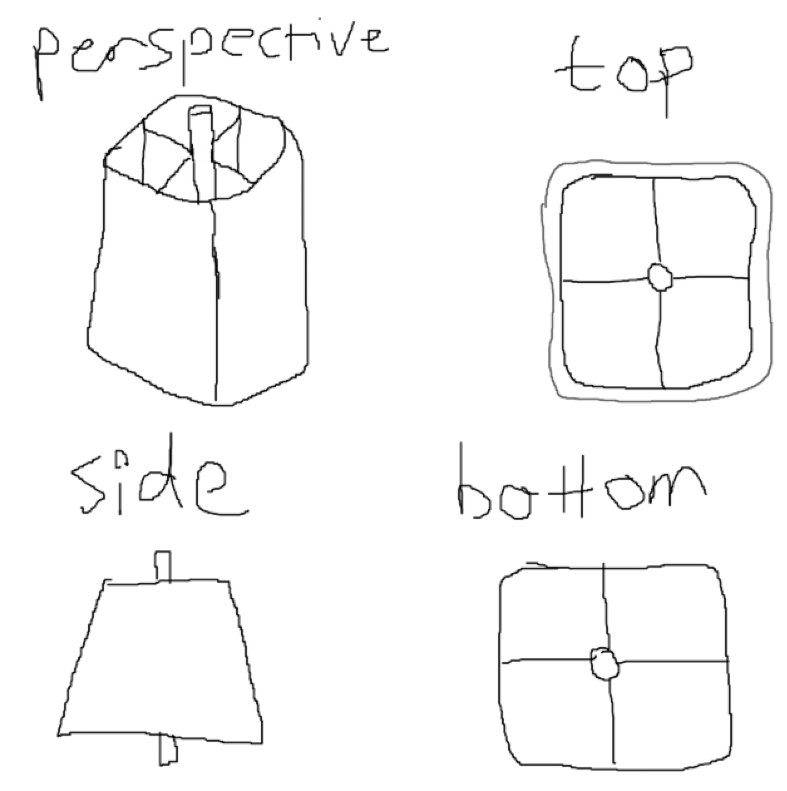

# Rapesco 500 Heavy Duty Tape Dispenser Core Replacement (3D model)

I broke the central core in my 25mm core wheel.

[3D model](https://github.com/alifeee/sellotape-core/blob/main/Tape%20Roller.STL)

3d modelling a replacement core for my sellotape dispenser.

Crude schematic with measurements::

3D model:

[`Tape Roller.STL`](https://github.com/alifeee/sellotape-core/blob/main/Tape%20Roller.STL)
